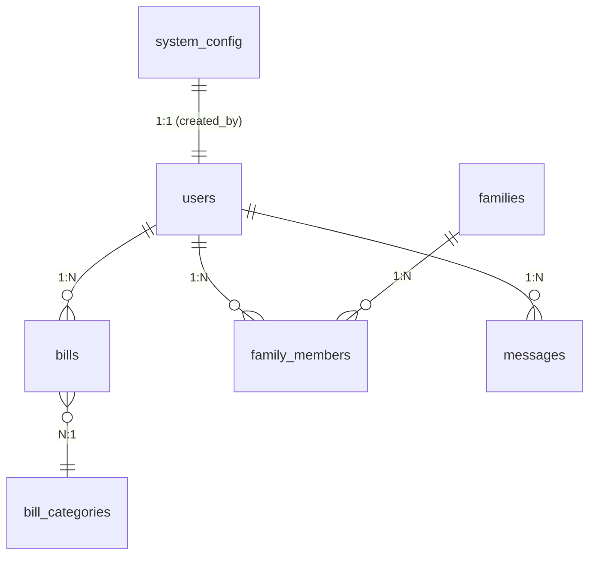

# 项目梳理文档

> **最后更新**: 2025-07-31

---

## 目录

1. [项目概述](#项目概述)
2. [技术栈](#技术栈)
3. [整体目录结构](#整体目录结构)
4. [后端架构详解](#后端架构详解)
   1. [应用入口与初始化](#应用入口与初始化)
   2. [配置管理](#配置管理)
   3. [中间件与异常处理](#中间件与异常处理)
   4. [路由划分](#路由划分)
   5. [服务层 (Service)](#服务层-service)
   6. [数据模型 (SQLAlchemy)](#数据模型-sqlalchemy)
   7. [数据校验模型 (Pydantic)](#数据校验模型-pydantic)
   8. [账单解析器 (Parser)](#账单解析器-parser)
   9. [数据库迁移](#数据库迁移)
5. [API 概览](#api-概览)
6. [数据库模型与关系](#数据库模型与关系)
7. [前端架构与模块](#前端架构与模块)
8. [测试策略](#测试策略)
9. [部署与运维](#部署与运维)
10. [开发运行指南](#开发运行指南)
11. [未来改进方向](#未来改进方向)

---

## 项目概述

`my-bills-2` 是一款 **个人/家庭账单管理系统**，提供账单导入、分类、统计分析、家庭共享、权限管理等功能，定位为「**一站式收支管理与分析平台**」。

- **核心特色**
  - 支持多来源账单解析 (支付宝、京东、招商银行 PDF 等)。
  - 家庭共享与成员角色控制。
  - 丰富的统计图表，直观展示财务状况。
  - RESTful API + 前后端分离，易于二次开发与集成。

---

## 技术栈

### 后端 (Python 3.11)

| 领域 | 使用框架/库 | 说明 |
| ---- | ----------- | ---- |
| Web 框架 | FastAPI | 现代异步 Web & API 框架 |
| ORM | SQLAlchemy 2.x | 数据库抽象层，配合 Alembic 做迁移 |
| 数据库 | PostgreSQL (默认) / SQLite(开发) | 支持多环境切换 |
| 认证 | python-jose, passlib | JWT 生成 & 校验，密码加密 |
| 配置 | Pydantic Settings | 统一读取 .env 与环境变量 |
| 数据处理 | pandas, pdfplumber | 解析 CSV / PDF 账单 |
| 任务脚本 | 原生 Python / Shell | 数据修复、分析脚本 |

### 前端 (TypeScript)

| 领域 | 使用框架/库 | 说明 |
| ---- | ----------- | ---- |
| UI 框架 | React 18 + Vite | 快速构建与热更新 |
| UI 组件 | Ant Design 5 | 高质量企业级组件库 |
| 状态管理 | Zustand | 轻量全局状态 |
| 网络请求 | Axios | 封装于 `src/api/client.ts` |
| 路由 | React Router DOM 6 | 文件级路由配置 |
| 数据可视化 | Recharts | 图表与趋势展示 |

---

## 整体目录结构

```text
my-bills-2/
├── backend/            # 后端源代码
│   ├── api/            # 路由层，每个文件一个资源域
│   ├── config/         # 数据库/日志/环境配置
│   ├── core/           # 中间件、异常等核心通用逻辑
│   ├── models/         # SQLAlchemy 数据模型
│   ├── schemas/        # Pydantic 校验 & 响应模型
│   ├── services/       # 业务逻辑封装
│   ├── parsers/        # 账单文件解析器
│   ├── migrations/     # Alembic / 手写迁移脚本
│   ├── main.py         # FastAPI 入口
│   └── ...
├── frontend/           # React + TS 前端
│   ├── src/
│   │   ├── api/        # Axios 客户端 & 服务封装
│   │   ├── components/ # 通用组件
│   │   ├── pages/      # 路由页面
│   │   ├── stores/     # Zustand stores
│   │   ├── types/      # 共享类型
│   │   └── utils/
│   └── public/
├── tests/              # pytest 测试 (近 60+ 用例)
├── scripts/            # 数据分析、修复、排错脚本
└── docs/               # 项目文档 (当前文件位于此)
```

> **约定**: 后端遵循「`api` 调用 `services`，`services` 操作 `models`」的三层分离；前端采用页面-组件-状态分层，所有网络请求由 `api/services.ts` 统一封装。

---

## 后端架构详解

### 应用入口与初始化

- `backend/main.py` 是 FastAPI 实例化入口，步骤：
  1. 读取配置 (`config/settings.py`)。
  2. 初始化日志 (`config/logging.py`)。
  3. 注册中间件 & 路由 (`include_router`)。
  4. 创建数据库表（可选，开发环境）。

### 配置管理

- 采用 `pydantic.BaseSettings` 管理多环境变量，`.env` 文件位于 `backend/config/environments/`。
- `config/database.py` 通过 **SQLAlchemy 2.0 style** 创建 `SessionLocal`，同时暴露 `get_db` 依赖。

### 中间件与异常处理

- `core/middleware.py` 提供：
  - 统一请求 ID 记录
  - 跨域 (CORSMiddleware)
  - 捕获未处理异常并统一返回 JSON
- `core/exceptions.py` 定义自定义业务异常 (e.g. `DuplicateUploadException`)

### 路由划分

| 文件 | 路由前缀 | 主要功能 |
| ---- | -------- | -------- |
| `api/auth.py` | `/auth` | 登录、注册、令牌刷新 |
| `api/users.py` | `/users` | 用户 CRUD，管理员专属 |
| `api/families.py` | `/families` | 家庭组创建/成员管理 |
| `api/bills.py` | `/bills` | 账单导入、查询、过滤 |
| `api/messages.py` | `/messages` | 家庭/系统消息 |
| `api/system_config.py` | `/system-config` | 系统级配置项 |
| `api/upload.py` | `/upload` | 大文件直传接口 |

### 服务层 (Service)

- 将复杂业务从路由中抽离，易于单元测试。
- 示例：`services.family_service.py` 负责家庭组成员邀请、角色变更逻辑。

### 数据模型 (SQLAlchemy)

- **User** / **Family** / **Bill** / **Message** 等共 16+ 表。
- 使用 **hybrid property** & relationship 管理外键。
- 自动生成 `created_at` / `updated_at` 时间戳。

### 数据校验模型 (Pydantic)

- 位于 `schemas/`；分 **请求模型 (Create/Update)** 与 **响应模型 (Response)**。
- 统一响应包装 `schemas.common.ApiResponse[T]` 增强前端一致性。

### 账单解析器 (Parser)

| 文件 | 来源 | 说明 |
| ---- | ---- | ---- |
| `parsers/alipay_parser.py` | 支付宝 CSV | 解析 & 去重 |
| `parsers/jd_parser.py` | 京东 PDF | 解析数据并纠正金额误差 |
| `parsers/cmb_parser.py` | 招商银行 PDF | 结构化提取 |
- 所有解析器继承 `parsers/base_parser.BaseParser`。

### 数据库迁移

- 采用 **手写 SQL + 脚本** 结合：`migrations/*.sql` + `migrations/*.py`。
- 执行方式见 `backend/DEPLOY.md` 或 `scripts/run.py`。

---

## API 概览

```text
POST   /auth/login           用户登录 (返回 JWT)
POST   /auth/register        用户注册
GET    /bills                账单列表 (分页+多条件)
POST   /bills/upload         批量导入账单文件
GET    /stats/summary        收支汇总统计
GET    /users                用户分页查询 (管理员)
PUT    /users/{id}           更新用户
DELETE /users/{id}           删除用户
...
```

更多详细接口请参考 **OpenAPI 文档**：启动后访问 `http://localhost:8000/docs`。

---

## 数据库模型与关系



**说明**

- `FamilyMember` 是 **桥接表**，维护 `user_id` 与 `family_id` 的多对多关系，并附带 `role` 字段。
- `BillCategory` 支持父子层级 (`parent_id`) 以实现多级分类。
- `SystemConfig` 用于全局开关，例如功能灰度发布。

---

## 前端架构与模块

1. **路由 & 页面**
   - `src/pages/*Page.tsx` 对应后端资源域。
   - 通过 `BrowserRouter` + `ProtectedRoute` 实现登录拦截。

2. **状态管理 (Zustand)**
   - 每个资源 (auth/bills/family/message) 对应一个 Store，支持 **persist** 插件持久化。

3. **API 服务层**
   - `api/services.ts` 封装所有 Axios 请求，使用 **拦截器** 注入 JWT。

4. **UI 设计**
   - 采用 Ant Design 主题，自定义 `theme/token` 位于 `App.css`。

5. **数据可视化**
   - `StatsPage` 使用 `Recharts` 组合折线/柱状图展示收支趋势。

---

## 测试策略

- **后端**: `pytest` + `pytest-asyncio`
  - `tests/` 目录下包含 **70+** 单元 & 集成测试覆盖解析器、API、权限等。
  - 使用 **数据库事务回滚** 保持测试隔离。
- **脚本验证**: `scripts/analysis/*` 用于数据一致性校验。
- **前端**: 当前暂无自动化测试，建议后续接入 `vitest` 或 `React Testing Library`。

---

## 部署与运维

| 环节 | 说明 |
| ---- | ---- |
| 后端 | `uvicorn backend.main:app --host 0.0.0.0 --port 8000` (见 `backend/deploy.sh`) |
| 前端 | `npm run build && npm run preview` 或通过 Nginx 托管 `dist/` |
| 数据库 | `setup_postgres.py` 可一键创建用户 & 数据库 |
| CI/CD | 可结合 GitHub Actions 触发 `Makefile` 任务 (测试 + 构建 + 部署) |
| SSL  | `ssl-certs/deploy-ssl.sh` 提供证书自动更新示例 |

---

## 开发运行指南

1. **环境准备**
   ```bash
   # Clone & Install backend deps
   poetry install  # 或 pip install -r requirements.txt

   # Install frontend deps
   cd frontend && npm ci
   ```
2. **启动服务**
   ```bash
   uvicorn backend.main:app --reload          # 监听 8000
   cd frontend && npm run dev                # 监听 5173
   ```
3. **运行测试**
   ```bash
   pytest -q
   ```

---

## 未来改进方向

- [ ] **前端单元测试**: 接入 Vitest + RTL，确保组件可靠性。
- [ ] **CI/CD Pipeline**: 建议添加自动化构建 & 部署流水线。
- [ ] **权限细粒度**: 将现有 admin/user 扩展为基于 RBAC 的多角色体系。
- [ ] **账单 OCR**: 对于扫描版或图像账单，集成 OCR 自动识别。
- [ ] **Docker 一键部署**: 提供 `docker-compose.yml` 简化环境搭建。

---

> **文档维护**: 如发现文档与实现不符，请在对应 PR 中同步更新此文件。